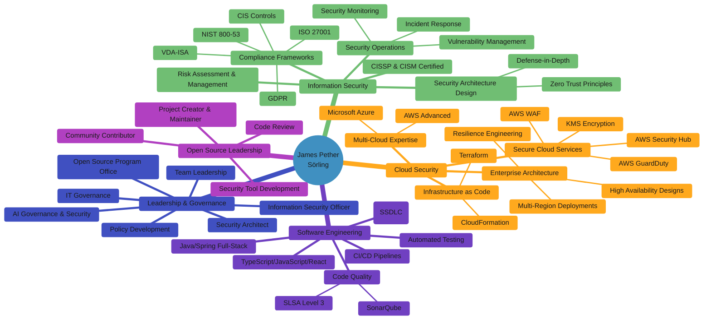
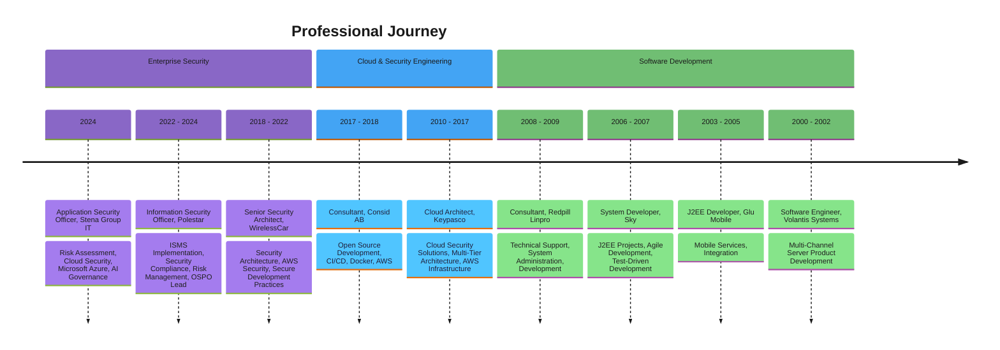

# Security & Open Source Expert | Cloud Security Specialist | Information Security Professional

  
  
  
  

---

# 🎤 Talks & Resources by James Pether Sörling

This repository contains resources and talks by James Pether Sörling, focusing on secure development practices, application security testing, and compliance automation. Below you'll find resources from presentations, security testing tools, and examples for implementing secure practices in your projects.

## 📋 Contents

- [Secure Development Pipeline Talk](#secure-development-pipeline-talk)
- [License Tools for Java Projects](#license-tools-for-java-projects)
- [Security Testing Tools](#security-testing-tools)
- [Practical Examples](#practical-examples)
- [Projects & Expertise](#projects--expertise)
- [About Me](#about-me)

---

## 🔐 Secure Development Pipeline Talk

James Pether Sörling presented this talk at Javaforum Göteborg, where he discussed how to secure your development pipeline with static application security tests (SAST), dynamic application security tests (DAST), and software composition analysis (SCA) using SonarQube.

The presentation covers:
- Integrating security into CI/CD pipelines
- DevSecOps implementation strategies
- Compliance automation techniques
- Real-world examples of security testing tools

**Podcast & Videos:**
- Guest on the ["Shift Left Like A Boss"](https://www.youtube.com/watch?v=aYwSd1Wu28Q&ab_channel=Soluble/) security podcast
- Javaforum Göteborg [presentation video](https://www.youtube.com/watch?v=A_hq2Y03d6I)

**Presentation Materials:**
- [PowerPoint](https://github.com/Hack23/talks/raw/master/SecureDevelopmentPipeline20190919.pptx)
- [OpenDocument](https://github.com/Hack23/talks/raw/master/SecureDevelopmentPipeline20190919.odp)

---

## 📜 License Tools for Java Projects

A comprehensive comparison of license compliance tools for Java projects:
- [LicenseComplianceAlternatives.md](https://github.com/Hack23/talks/blob/master/LicenseComplianceAlternatives.md)

This guide covers tools for license detection, compatibility analysis, and compliance management specifically for Java ecosystems.

---

## 🛡️ Security Testing Tools

### CloudFormation Security
- [cfn_nag](https://github.com/stelligent/cfn_nag) - Static analysis tool for CloudFormation templates
- [SonarQube CloudFormation plugin](https://github.com/Hack23/sonar-cloudformation-plugin) - Integrate CloudFormation security checks into SonarQube

### Container Security
- [Trivy](https://github.com/aquasecurity/trivy) - Vulnerability scanner for containers and filesystems
- [Container Check Sonar plugin](https://github.com/ministryofjustice/container-check-sonar-plugin) - Container security analysis in SonarQube

### CI/CD Examples
- [Hack23 CIA Jenkinsfile](https://github.com/Hack23/cia/blob/master/Jenkinsfile) - Real-world example of security-focused CI/CD pipeline

---

## 🔥 Black Trigram (흑괘)

<table>
  <tr>
    <td width="120" align="center">
      
      

        
      

    </td>
    <td>
      
<strong>Realistic 2D precision combat simulator</strong> inspired by traditional Korean martial arts, focusing on precise anatomical targeting, authentic combat techniques, and detailed physics-based interactions.

      

        
        
      

      

        <a href="https://blacktrigram.com"><strong>🌐 Official Website</strong></a> •
        <a href="https://github.com/Hack23/blacktrigram"><strong>📂 Repository</strong></a> •
        <a href="https://hack23.com/black-trigram-docs.html"><strong>📚 Documentation</strong></a>
      

    </td>
  </tr>
</table>

---

## 🌟 Featured Projects

<table>
  <tr>
    <td width="50%">
      <h3 align="center">🔐 CIA Compliance Manager</h3>
      

        
        
<i>Security assessment platform for the CIA triad with compliance mapping to regulatory frameworks</i>

        

          <a href="https://hack23.github.io/cia-compliance-manager/">🚀 Live Demo</a> |
          <a href="https://github.com/Hack23/cia-compliance-manager">📂 Repository</a> |
          <a href="https://hack23.com/cia-compliance-manager-features.html">✨ Features</a>
        

        
        
        
      

    </td>
    <td width="50%">
      <h3 align="center">🔍 Citizen Intelligence Agency</h3>
      

        
        
<i>Political transparency platform monitoring Swedish political activity with data-driven insights</i>

        

          <a href="https://github.com/Hack23/cia">📂 Repository</a> |
          <a href="https://hack23.com/cia-features.html">✨ Features</a> |
          <a href="https://github.com/Hack23/cia/blob/master/SECURITY_ARCHITECTURE.md">🔒 Security</a>
        

        
        
        
      

    </td>
  </tr>
  <tr>
    <td width="50%">
      <h3 align="center">☁️ Lambda in Private VPC</h3>
      

        
        
<i>Multi-region active/active site leveraging Resilience Hub policy compliance and runbooks</i>

        

          <a href="https://github.com/Hack23/lambda-in-private-vpc/blob/master/README.md">📑 Documentation</a> |
          <a href="https://github.com/Hack23/lambda-in-private-vpc/actions/workflows/main.yml">🔄 CI/CD</a>
        

        
        
      

    </td>
    <td width="50%">
      <h3 align="center">🧪 Sonar-CloudFormation-Plugin</h3>
      

        
        
<i>SonarQube plugin for analyzing AWS CloudFormation templates with security best practices</i>

        

          <a href="https://github.com/Hack23/sonar-cloudformation-plugin/blob/master/README.md">📑 Documentation</a> |
          <a href="http://mvnrepository.com/artifact/com.hack23.sonar/sonar-cloudformation-plugin">📦 Maven</a>
        

        
        
      

    </td>
  </tr>
</table>

---

## 🏛️ Project Architecture & Documentation

<table>
  <tr>
    <th>Project</th>
    <th>Current Architecture</th>
    <th>Security Architecture</th>
    <th>Future Vision</th>
  </tr>
  <tr>
    <td> CIA Compliance Manager</td>
    <td><a href="https://github.com/Hack23/cia-compliance-manager/blob/main/docs/architecture/ARCHITECTURE.md">🏛️ Architecture</a></td>
    <td><a href="https://github.com/Hack23/cia-compliance-manager/blob/main/docs/architecture/SECURITY_ARCHITECTURE.md">🔒 Security</a></td>
    <td><a href="https://github.com/Hack23/cia-compliance-manager/blob/main/docs/architecture/FUTURE_ARCHITECTURE.md">🔮 Future</a></td>
  </tr>
  <tr>
    <td> Citizen Intelligence Agency</td>
    <td><a href="https://github.com/Hack23/cia/blob/master/ARCHITECTURE.md">🏛️ Architecture</a></td>
    <td><a href="https://github.com/Hack23/cia/blob/master/SECURITY_ARCHITECTURE.md">🔒 Security</a></td>
    <td><a href="https://github.com/Hack23/cia/blob/master/FUTURE_ARCHITECTURE.md">🔮 Future</a></td>
  </tr>
</table>

<table>
  <tr>
    <th>Project</th>
    <th>Process Flows</th>
    <th>State Diagrams</th>
    <th>Mindmaps</th>
  </tr>
  <tr>
    <td> CIA Compliance Manager</td>
    <td><a href="https://github.com/Hack23/cia-compliance-manager/blob/main/docs/architecture/FLOWCHART.md">📊 Flowcharts</a></td>
    <td><a href="https://github.com/Hack23/cia-compliance-manager/blob/main/docs/architecture/STATEDIAGRAM.md">🔄 States</a></td>
    <td><a href="https://github.com/Hack23/cia-compliance-manager/blob/main/docs/architecture/MINDMAP.md">🧠 Mindmaps</a></td>
  </tr>
  <tr>
    <td> Citizen Intelligence Agency</td>
    <td><a href="https://github.com/Hack23/cia/blob/master/FLOWCHART.md">📊 Flowcharts</a></td>
    <td><a href="https://github.com/Hack23/cia/blob/master/STATEDIAGRAM.md">🔄 States</a></td>
    <td><a href="https://github.com/Hack23/cia/blob/master/MINDMAP.md">🧠 Mindmaps</a></td>
  </tr>
</table>

---

## 👤 About Me

Experienced security professional with over 30 years in information technology, specializing in security architecture, cloud security, and compliance. Currently serving as Application Security Officer at Stena Group IT, with prior roles including Information Security Officer at Polestar and Senior Security Architect at WirelessCar. Strong advocate for transparency in organizations, secure software development practices, and innovative open source solutions.

I develop advanced open source tools focused on:
- 🔐 **CIA Triad** (Confidentiality, Integrity, Availability)
- 📊 **Compliance Management**
- 🔍 **Political Transparency**
- ☁️ **Secure Cloud Architectures**

**Press and Mentions:**
- [Computer Sweden](https://computersweden.idg.se/2.2683/1.689115/teknik-avslojar-politiker)
- [Riksdag och Departement](https://www.rid.se/nyheter/2018/06/cia-granskar-riksdagen/)
- [Expressen](https://www.expressen.se/debatt/sa-kan-vi-stoppa-politikernas-utanforskap/)
- [National Democratic Institute](https://www.ndi.org/sites/default/files/Strengthening-Parliamentary-Accountability_Citizen_Engagement_and_Access_to_Information.pdf)

---

## 🏅 Professional Certifications

  
  
  
  

---

### Professional Experience & Skills

---

### Career Highlights

---

## 🛠️ Technology & Skills

#### Security & Compliance

#### Cloud & Infrastructure

#### Development & Languages

#### DevOps & Tools

---

## 🏆 Notable Contributions & Appearances

- Information Security Officer at Polestar, leading security practices and the Open Source Program Office
- Senior Security Architect at WirelessCar, supporting secure delivery practices and security risk management
- Open source contributor for cfn-nag, developing integration with SonarQube for CloudFormation security analysis
- Speaker at [Javaforum Göteborg](https://www.youtube.com/watch?v=A_hq2Y03d6I) on secure architecture patterns
- Guest on [Shift Left Like A Boss](https://www.youtube.com/watch?v=aYwSd1Wu28Q&ab_channel=Soluble/) security podcast
- Featured in Computer Sweden and Riksdag och Departement for political transparency work
- Mentioned in National Democratic Institute survey on parliamentary monitoring organizations
- Operated Equal Rites BBS in the 1990s, part of Fidonet (Node 2:203/454)
- 

---

### Project Badges & Status

##### CIA Compliance Manager

##### Citizen Intelligence Agency

---

## 🤝 Connect With Me

  
  
  
  

   
  
  
Last updated: 2025-06-14 16:23:03

