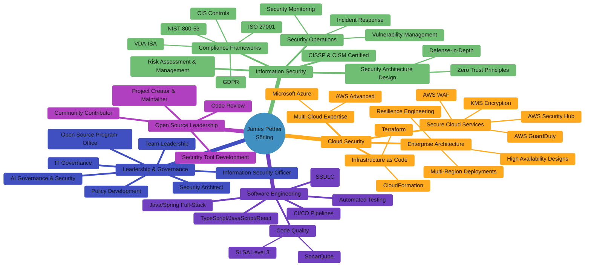
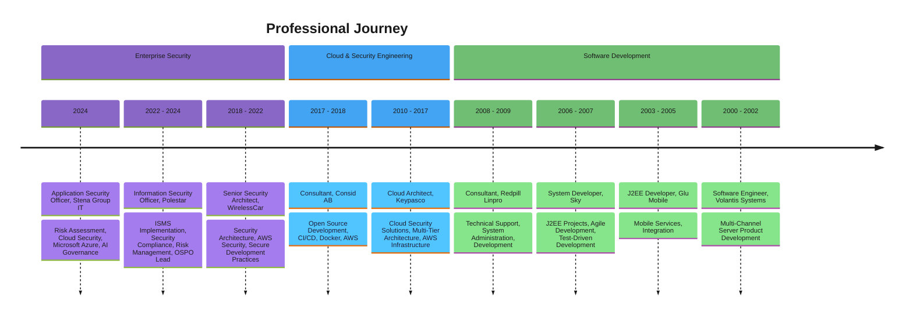

# Security & Open Source Expert | Cloud Security Specialist | Information Security Professional

  
  
  
  
  

---

# 🎤 Talks & Resources by James Pether Sörling

This repository contains resources and talks by James Pether Sörling, focusing on secure development practices, application security testing, and compliance automation. Below you'll find resources from presentations, security testing tools, and examples for implementing secure practices in your projects.

## 📋 Contents

- [Referenced ISMS Policies](#-referenced-isms-policies)
- [Secure Development Pipeline Talk](#secure-development-pipeline-talk)
- [License Tools for Java Projects](#license-tools-for-java-projects)
- [Security Testing Tools](#security-testing-tools)
- [Practical Examples](#practical-examples)
- [Projects & Expertise](#projects--expertise)
- [About Me](#about-me)

---

## 🔐 Referenced ISMS Policies

All security practices and compliance approaches discussed in these presentations are backed by Hack23 AB's publicly available Information Security Management System (ISMS). This demonstrates our commitment to security-through-transparency.

  

### Core Security Policies

<table>
  <tr>
    <th>Policy Area</th>
    <th>Document</th>
    <th>Description</th>
  </tr>
  <tr>
    <td>🔐 Information Security</td>
    <td><a href="https://github.com/Hack23/ISMS-PUBLIC/blob/main/Information_Security_Policy.md">Information Security Policy</a></td>
    <td>Foundation of our security management system, defining security principles and governance structure</td>
  </tr>
  <tr>
    <td>🛠️ Secure Development</td>
    <td><a href="https://github.com/Hack23/ISMS-PUBLIC/blob/main/Secure_Development_Policy.md">Secure Development Policy</a></td>
    <td>DevSecOps practices, CI/CD security, SAST/DAST/SCA requirements, and compliance automation</td>
  </tr>
  <tr>
    <td>📜 Open Source Compliance</td>
    <td><a href="https://github.com/Hack23/ISMS-PUBLIC/blob/main/Open_Source_Policy.md">Open Source Policy</a></td>
    <td>Open source license compliance, SBOM generation, and vulnerability management</td>
  </tr>
  <tr>
    <td>🤝 Third-Party Management</td>
    <td><a href="https://github.com/Hack23/ISMS-PUBLIC/blob/main/Third_Party_Management.md">Third Party Management</a></td>
    <td>Vendor security assessment, supply chain risk management, and procurement security</td>
  </tr>
  <tr>
    <td>🔍 Vulnerability Management</td>
    <td><a href="https://github.com/Hack23/ISMS-PUBLIC/blob/main/Vulnerability_Management_Procedure.md">Vulnerability Management Procedure</a></td>
    <td>Systematic approach to identifying, assessing, and remediating security vulnerabilities</td>
  </tr>
</table>

For a complete mapping of presentation topics to ISMS policies, see [ISMS_REFERENCE_GUIDE.md](ISMS_REFERENCE_GUIDE.md).

---

## 🔐 Secure Development Pipeline Talk

James Pether Sörling presented this talk at Javaforum Göteborg, where he discussed how to secure your development pipeline with static application security tests (SAST), dynamic application security tests (DAST), and software composition analysis (SCA) using SonarQube.

The presentation covers:
- Integrating security into CI/CD pipelines
- DevSecOps implementation strategies
- Compliance automation techniques
- Real-world examples of security testing tools

**Podcast & Videos:**
- Guest on the ["Shift Left Like A Boss"](https://www.youtube.com/watch?v=aYwSd1Wu28Q&ab_channel=Soluble/) security podcast
- Javaforum Göteborg [presentation video](https://www.youtube.com/watch?v=A_hq2Y03d6I)

**Presentation Materials:**
- [PowerPoint](https://github.com/Hack23/talks/raw/master/SecureDevelopmentPipeline20190919.pptx)
- [OpenDocument](https://github.com/Hack23/talks/raw/master/SecureDevelopmentPipeline20190919.odp)

---

## 📜 License Tools for Java Projects

A comprehensive comparison of license compliance tools for Java projects:
- [LicenseComplianceAlternatives.md](https://github.com/Hack23/talks/blob/master/LicenseComplianceAlternatives.md)

This guide covers tools for license detection, compatibility analysis, and compliance management specifically for Java ecosystems.

---

## 🛡️ Security Testing Tools

### CloudFormation Security
- [cfn_nag](https://github.com/stelligent/cfn_nag) - Static analysis tool for CloudFormation templates
- [SonarQube CloudFormation plugin](https://github.com/Hack23/sonar-cloudformation-plugin) - Integrate CloudFormation security checks into SonarQube

### Container Security
- [Trivy](https://github.com/aquasecurity/trivy) - Vulnerability scanner for containers and filesystems
- [Container Check Sonar plugin](https://github.com/ministryofjustice/container-check-sonar-plugin) - Container security analysis in SonarQube

### CI/CD Examples
- [Hack23 CIA Jenkinsfile](https://github.com/Hack23/cia/blob/master/Jenkinsfile) - Real-world example of security-focused CI/CD pipeline

---

## 🔥 Black Trigram (흑괘)

<table>
  <tr>
    <td width="120" align="center">
      
      

        
      

    </td>
    <td>
      
<strong>Realistic 2D precision combat simulator</strong> inspired by traditional Korean martial arts, focusing on precise anatomical targeting, authentic combat techniques, and detailed physics-based interactions.

      

        
        
      

      

        <a href="https://blacktrigram.com"><strong>🌐 Official Website</strong></a> •
        <a href="https://github.com/Hack23/blacktrigram"><strong>📂 Repository</strong></a> •
        <a href="https://hack23.com/black-trigram-docs.html"><strong>📚 Documentation</strong></a>
      

    </td>
  </tr>
</table>

---

## 🌟 Featured Projects

<table>
  <tr>
    <td width="50%">
      <h3 align="center">🔐 CIA Compliance Manager</h3>
      

        
        
<i>Security assessment platform for the CIA triad with compliance mapping to regulatory frameworks</i>

        

          <a href="https://hack23.github.io/cia-compliance-manager/">🚀 Live Demo</a> |
          <a href="https://github.com/Hack23/cia-compliance-manager">📂 Repository</a> |
          <a href="https://hack23.com/cia-compliance-manager-features.html">✨ Features</a>
        

        
        
        
      

    </td>
    <td width="50%">
      <h3 align="center">🔍 Citizen Intelligence Agency</h3>
      

        
        
<i>Political transparency platform monitoring Swedish political activity with data-driven insights</i>

        

          <a href="https://github.com/Hack23/cia">📂 Repository</a> |
          <a href="https://hack23.com/cia-features.html">✨ Features</a> |
          <a href="https://github.com/Hack23/cia/blob/master/SECURITY_ARCHITECTURE.md">🔒 Security</a>
        

        
        
        
      

    </td>
  </tr>
  <tr>
    <td width="50%">
      <h3 align="center">☁️ Lambda in Private VPC</h3>
      

        
        
<i>Multi-region active/active site leveraging Resilience Hub policy compliance and runbooks</i>

        

          <a href="https://github.com/Hack23/lambda-in-private-vpc/blob/master/README.md">📑 Documentation</a> |
          <a href="https://github.com/Hack23/lambda-in-private-vpc/actions/workflows/main.yml">🔄 CI/CD</a>
        

        
        
      

    </td>
    <td width="50%">
      <h3 align="center">🧪 Sonar-CloudFormation-Plugin</h3>
      

        
        
<i>SonarQube plugin for analyzing AWS CloudFormation templates with security best practices</i>

        

          <a href="https://github.com/Hack23/sonar-cloudformation-plugin/blob/master/README.md">📑 Documentation</a> |
          <a href="http://mvnrepository.com/artifact/com.hack23.sonar/sonar-cloudformation-plugin">📦 Maven</a>
        

        
        
      

    </td>
  </tr>
</table>

---

## 🏛️ Project Architecture & Documentation

<table>
  <tr>
    <th>Project</th>
    <th>Current Architecture</th>
    <th>Security Architecture</th>
    <th>Future Vision</th>
  </tr>
  <tr>
    <td> CIA Compliance Manager</td>
    <td><a href="https://github.com/Hack23/cia-compliance-manager/blob/main/docs/architecture/ARCHITECTURE.md">🏛️ Architecture</a></td>
    <td><a href="https://github.com/Hack23/cia-compliance-manager/blob/main/docs/architecture/SECURITY_ARCHITECTURE.md">🔒 Security</a></td>
    <td><a href="https://github.com/Hack23/cia-compliance-manager/blob/main/docs/architecture/FUTURE_ARCHITECTURE.md">🔮 Future</a></td>
  </tr>
  <tr>
    <td> Citizen Intelligence Agency</td>
    <td><a href="https://github.com/Hack23/cia/blob/master/ARCHITECTURE.md">🏛️ Architecture</a></td>
    <td><a href="https://github.com/Hack23/cia/blob/master/SECURITY_ARCHITECTURE.md">🔒 Security</a></td>
    <td><a href="https://github.com/Hack23/cia/blob/master/FUTURE_ARCHITECTURE.md">🔮 Future</a></td>
  </tr>
</table>

<table>
  <tr>
    <th>Project</th>
    <th>Process Flows</th>
    <th>State Diagrams</th>
    <th>Mindmaps</th>
  </tr>
  <tr>
    <td> CIA Compliance Manager</td>
    <td><a href="https://github.com/Hack23/cia-compliance-manager/blob/main/docs/architecture/FLOWCHART.md">📊 Flowcharts</a></td>
    <td><a href="https://github.com/Hack23/cia-compliance-manager/blob/main/docs/architecture/STATEDIAGRAM.md">🔄 States</a></td>
    <td><a href="https://github.com/Hack23/cia-compliance-manager/blob/main/docs/architecture/MINDMAP.md">🧠 Mindmaps</a></td>
  </tr>
  <tr>
    <td> Citizen Intelligence Agency</td>
    <td><a href="https://github.com/Hack23/cia/blob/master/FLOWCHART.md">📊 Flowcharts</a></td>
    <td><a href="https://github.com/Hack23/cia/blob/master/STATEDIAGRAM.md">🔄 States</a></td>
    <td><a href="https://github.com/Hack23/cia/blob/master/MINDMAP.md">🧠 Mindmaps</a></td>
  </tr>
</table>

---

## 👤 About Me

Experienced security professional with over 30 years in information technology, specializing in security architecture, cloud security, and compliance. Currently serving as Application Security Officer at Stena Group IT, with prior roles including Information Security Officer at Polestar and Senior Security Architect at WirelessCar. Strong advocate for transparency in organizations, secure software development practices, and innovative open source solutions.

I develop advanced open source tools focused on:
- 🔐 **CIA Triad** (Confidentiality, Integrity, Availability)
- 📊 **Compliance Management**
- 🔍 **Political Transparency**
- ☁️ **Secure Cloud Architectures**

## 🌟 Featured in Press & Media

<table>
  <tr>
    <td width="25%">
      

        <h3>🗞️ Computer Sweden</h3>
        
Featured article on innovative use of technology for political transparency

        <a href="https://computersweden.idg.se/2.2683/1.229120/tekniken-som-avslojar-politikerna">Read Article</a>
      

    </td>
    <td width="25%">
      

        <h3>📰 Riksdag och Departement</h3>
        
Coverage on Citizen Intelligence Agency's monitoring capabilities

        <a href="https://web.archive.org/web/20090527045800/http:/www.rod.se/Artikelarkiv/2009/CIA-haller-koll-pa-riksdagsledamoterna/">Read Article</a>
      

    </td>
    <td width="25%">
      

        <h3>📊 National Democratic Institute</h3>
        
Recognized in survey of parliamentary monitoring organizations

        <a href="https://www.ndi.org/sites/default/files/governance-parliamentary-monitoring-organizations-survey-september-2011.pdf">View Report</a>
      

    </td>
    <td width="25%">
      

        <h3>📰 Expressen</h3>
        
Eric Erfors credits Citizen Intelligence Agency for exposing politician voting attendance records

        <a href="https://www.expressen.se/ledare/eric-erfors/eric-erfors-skolkaren-sahlin/">Read Article</a>
      

    </td>
  </tr>
</table>

## 🎤 Technical Talks & Presentations

<table>
  <tr>
    <td width="50%">
      

        <h3>🎙️ Javaforum Göteborg</h3>
        
Presentation on secure architecture patterns

        
      

    </td>
    <td width="50%">
      

        <h3>🎙️ Shift Left Like A Boss</h3>
        
Security podcast guest appearance discussing DevSecOps

        
      

    </td>
  </tr>
</table>

---

## 🏅 Professional Certifications

  
  
  
  

---

### Professional Experience & Skills

```mermaid
%%{
  init: {
    'theme': 'base',
    'themeVariables': {
      'primaryColor': '#a0c8e0',
      'primaryTextColor': '#1a1a1a',
      'primaryBorderColor': '#86b5d9',
      'lineColor': '#86b5d9',
      'secondaryColor': '#c8e6c9',
      'tertiaryColor': '#ffda9e'
    }
  }
}%%
mindmap
  root((James Pether<br>Sörling))
    Information Security
      ::icon(fa fa-shield)
      Risk Assessment & Management
      CISSP & CISM Certified
      Security Architecture Design
        Zero Trust Principles
        Defense-in-Depth
      Compliance Frameworks
        ISO 27001
        NIST 800-53 
        VDA-ISA
        CIS Controls
        GDPR
      Security Operations
        Incident Response
        Vulnerability Management
        Security Monitoring
    Cloud Security
      ::icon(fa fa-cloud)
      Multi-Cloud Expertise
        AWS Advanced
        Microsoft Azure
      Enterprise Architecture
        High Availability Designs
        Multi-Region Deployments
        Resilience Engineering
      Infrastructure as Code
        CloudFormation
        Terraform
      Secure Cloud Services
        AWS Security Hub
        AWS GuardDuty
        KMS Encryption
        AWS WAF
    Leadership & Governance
      ::icon(fa fa-users)
      Information Security Officer
      Security Architect
      Policy Development
      IT Governance
      Team Leadership
      Open Source Program Office
      AI Governance & Security
    Software Engineering
      ::icon(fa fa-code)
      Secure Development (SSDLC)
      Java/Spring Full-Stack
      TypeScript/JavaScript/React
      Automated Testing
      CI/CD Pipelines
      Code Quality
        SLSA Level 3
        SonarQube
    Open Source Leadership
      ::icon(fa fa-github)
      Project Creator & Maintainer
      Community Contributor
      Security Tool Development
      Code Review
```

---

### Career Highlights

```mermaid
%%{
  init: {
    'theme': 'base',
    'themeVariables': {
      'primaryColor': '#d1c4e9',
      'primaryTextColor': '#1a1a1a',
      'primaryBorderColor': '#9575cd',
      'lineColor': '#9575cd',
      'secondaryColor': '#bbdefb',
      'tertiaryColor': '#c8e6c9'
    }
  }
}%%
timeline
    title Professional Journey
    section Enterprise Security
      2024 : Application Security Officer, Stena Group IT
            : Risk Assessment, Cloud Security, Microsoft Azure, AI Governance
      2022 - 2024 : Information Security Officer, Polestar
            : ISMS Implementation, Security Compliance, Risk Management, OSPO Lead
      2018 - 2022 : Senior Security Architect, WirelessCar
            : Security Architecture, AWS Security, Secure Development Practices
    section Cloud & Security Engineering
      2017 - 2018 : Consultant, Consid AB
            : Open Source Development, CI/CD, Docker, AWS
      2010 - 2017 : Cloud Architect, Keypasco
            : Cloud Security Solutions, Multi-Tier Architecture, AWS Infrastructure
    section Software Development
      2008 - 2009 : Consultant, Redpill Linpro
            : Technical Support, System Administration, Development
      2006 - 2007 : System Developer, Sky
            : J2EE Projects, Agile Development, Test-Driven Development
      2003 - 2005 : J2EE Developer, Glu Mobile
            : Mobile Services, Integration
      2000 - 2002 : Software Engineer, Volantis Systems
            : Multi-Channel Server Product Development
```

---

## 🛠️ Technology & Skills

#### Security & Compliance

#### Cloud & Infrastructure

#### Development & Languages

#### DevOps & Tools

---

## 🏆 Notable Contributions & Appearances

- Information Security Officer at Polestar, leading security practices and the Open Source Program Office
- Senior Security Architect at WirelessCar, supporting secure delivery practices and security risk management
- Open source contributor for cfn-nag, developing integration with SonarQube for CloudFormation security analysis
- Speaker at [Javaforum Göteborg](https://www.youtube.com/watch?v=A_hq2Y03d6I) on secure architecture patterns
- Guest on [Shift Left Like A Boss](https://www.youtube.com/watch?v=aYwSd1Wu28Q&ab_channel=Soluble/) security podcast
- Featured in Computer Sweden and Riksdag och Departement for political transparency work
- Mentioned in National Democratic Institute survey on parliamentary monitoring organizations
- Operated Equal Rites BBS in the 1990s, part of Fidonet (Node 2:203/454)
- 

---

### Project Badges & Status

##### CIA Compliance Manager

##### Citizen Intelligence Agency

---

## 🤝 Connect With Me

  
  
  
  

## 🔑 Security Services

Professional cybersecurity consulting services delivered remotely or in-person in Gothenburg. Drawing from over three decades of experience in software development and security architecture, we deliver practical security solutions that integrate seamlessly into your development processes without hindering innovation.

---

## 📋 Service Overview

<table>
  <tr>
    <td>🌐 Availability</td>
    <td>Remote or in-person (Gothenburg)</td>
  </tr>
  <tr>
    <td>💰 Pricing</td>
    <td>Contact for pricing</td>
  </tr>
  <tr>
    <td>🏢 Company</td>
    <td>Hack23 AB (Org.nr 5595347807)</td>
  </tr>
  <tr>
    <td>📧 Contact</td>
    <td>LinkedIn</td>
  </tr>
</table>

---

## 🎯 Core Service Areas

<table>
  <tr>
    <th>Area</th>
    <th>Services</th>
    <th>Ideal for</th>
  </tr>
  <tr>
    <td>🏗️ Security Architecture & Strategy</td>
    <td>
      Enterprise Security Architecture: Design and implementation of comprehensive security frameworks 
      Risk Assessment & Management: Systematic identification and mitigation of security risks 
      Security Strategy Development: Alignment of security initiatives with business objectives 
      Governance Framework Design: Policy development and security awareness programs
    </td>
    <td>Organizations needing strategic security leadership and architectural guidance</td>
  </tr>
  <tr>
    <td>☁️ Cloud Security & DevSecOps</td>
    <td>
      Secure Cloud Solutions: AWS security assessment and architecture (Advanced level) 
      DevSecOps Integration: Security seamlessly integrated into agile development processes 
      Infrastructure as Code Security: Secure CloudFormation, Terraform implementations 
      Container & Serverless Security: Modern application security best practices
    </td>
    <td>Development teams transitioning to cloud-native architectures with security focus</td>
  </tr>
  <tr>
    <td>🔧 Secure Development & Code Quality</td>
    <td>
      Secure SDLC Implementation: Building security into development lifecycles 
      CI/CD Security Integration: Automated security testing and validation 
      Code Quality & Security Analysis: Static analysis, vulnerability scanning 
      Supply Chain Security: SLSA Level 3 compliance, SBOM implementation
    </td>
    <td>Development teams seeking to embed security without slowing innovation</td>
  </tr>
</table>

---

## 🏆 Specialized Expertise

<table>
  <tr>
    <th>Category</th>
    <th>Services</th>
    <th>Value</th>
  </tr>
  <tr>
    <td>📋 Compliance & Regulatory</td>
    <td>
      Regulatory Compliance: GDPR, NIS2, ISO 27001 implementation 
      ISMS Design & Implementation: Information Security Management Systems 
      AI Governance: Emerging AI risk management frameworks 
      Audit Preparation: Documentation and evidence preparation
    </td>
    <td>Navigate complex regulatory landscapes with confidence</td>
  </tr>
  <tr>
    <td>🌐 Open Source Security</td>
    <td>
      Open Source Program Office: OSPO establishment and management 
      Vulnerability Management: Open source risk assessment and remediation 
      Security Tool Development: Custom security solutions and automation 
      Community Engagement: Open source security best practices
    </td>
    <td>Leverage open source securely while contributing to security transparency</td>
  </tr>
  <tr>
    <td>🎓 Security Culture & Training</td>
    <td>
      Security Awareness Programs: Building organization-wide security culture 
      Developer Security Training: Secure coding practices and methodologies 
      Leadership Security Briefings: Executive-level security understanding 
      Incident Response Training: Preparedness and response capability building
    </td>
    <td>Transform security from barrier to enabler through education and culture</td>
  </tr>
</table>

---

## 💡 Why Choose Hack23 Security Services?

Three decades of hands-on experience in software development and security architecture means we understand the real challenges development teams face. We don't just point out problems—we provide practical, implementable solutions that enhance security without slowing down innovation.

**Our approach:** Security should be seamlessly integrated into your existing processes, not bolted on afterward. We help organizations build a culture of security awareness where protection becomes a natural part of how teams work, not an obstacle to overcome.

**Passionate about transparency:** As advocates for open source security, we believe in sharing knowledge and building community. Our solutions are designed to be understandable, maintainable, and aligned with industry best practices.

   
  
  
Last updated: 2025-06-14 16:23:03

